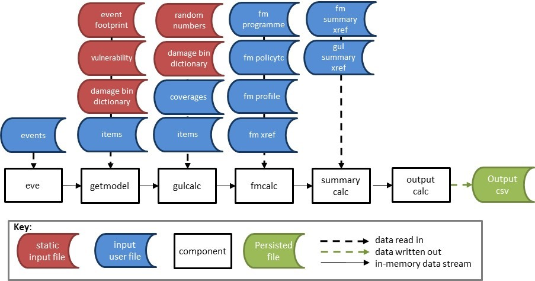
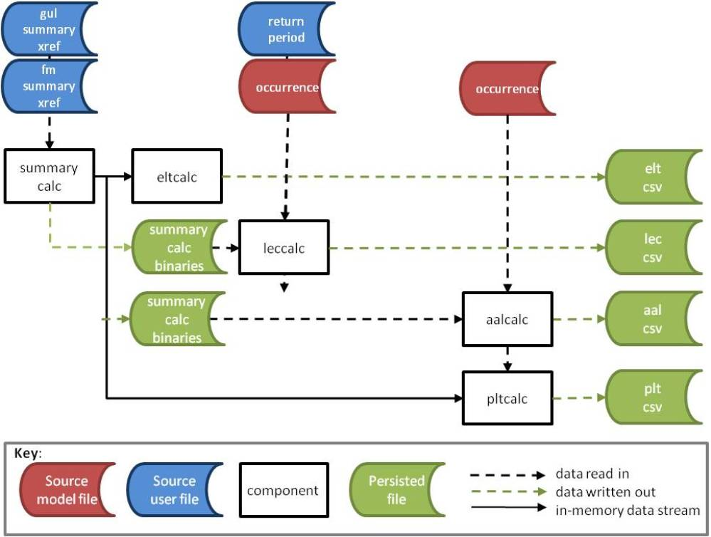

# 4. Reference Model Overview 

This section provides an overview of the reference model, which is an implementation of each of the components in the framework. 

There are four sub-sections which cover the usage and internal processes of each of the reference components;

* **[4.1 Core components](CoreComponents.md)**
* **[4.2 Output components](OutputComponents.md)**
* **[4.3 Data conversion components](DataConversionComponents.md)**
* **[4.4 Stream conversion components](StreamConversionComponents.md)**

The set of **[core components](CoreComponents.md)** provided in this release is as follows;
* **eve** is the event distributing utility. Based on the number of events in the input and the number of processes specified as a parameter, eve outputs subsets of the events as a stream. The output streams into getmodel.
* **getmodel** generates a stream of effective damageability cdfs for the input stream of events. It generates cdfs from the model files eventfootprint.bin and vulnerability.bin, and the user's exposures file which is called items.bin. getmodel streams into gulcalc or can be output to a binary file.
* **gulcalc** performs the ground up loss sampling calculations and numerical integration. The output is a stream of sampled ground up losses. This can be output to a binary file or streamed into  fmcalc or summarycalc.
* **fmcalc** performs the insured loss calculations on the ground up loss samples, mean, and total insured value. The output is a stream of insured loss samples. The result can be output to a binary file or streamed into summarycalc.
* **summarycalc** performs a summing of sampled losses according to the user's reporting requirements.  For example this might involve summing coverage losses to regional level, or policy losses to portfolio level.  The output is sampled loss by event_id and summary_id, which represents a meaningful group of losses to the user. 

The standard input and standard output data streams for the core components are covered in the Specification. 

Figure 1 shows the core components workflow and the required data input files.

##### Figure 1. Core components workflow and required data

The model **static** data for the core workflow, shown as red source files, are the event footprint, vulnerability, damage bin dictionary and random number file.  These are stored in the **'static'** sub-directory of the working folder.  

The user / analysis **input** data for the core workflow, shown as blue source files, are the events, items, coverages, fm programme, fm policytc, fm profile, fm xref, fm summary xref and gul summary xref files. These are stored in the **'input'** sub-directory of the working folder. 

These are all Oasis kernel format data objects with prescribed formats. Note that the events are a user input rather than a static input because the user could choose to run a subset of the full list of events, or even just one event. Usually, though, the whole event set will be run. 

The **[output components](OutputComponents.md)** are various implementations of outputcalc, as described in general terms in the [Specification](Specification.md). The results are written directly into csv file as there is no downstream processing.

* **eltcalc**  generates an event loss table from the sampled losses from summarycalc. It contains sample mean and standard deviation, and total exposed value for each event at the given summary level. 
* **leccalc**  generates loss exceedance curve from the sampled losses from summarycalc. There are 8 variants of curves with small differences in the output format but the common output fields are summary_id, return period, and loss exceedance threshold. This output is only available for models which provide an occurrence file.
* **pltcalc**  generates a period loss table from the sampled losses from summarycalc. It contains sample mean and standard deviation, and total exposed value for each event and each period (for example a year) at the given summary level. It also contains a date field, corresponding to the date of the event occurrence. This output is only available for models which provide an occurrence file.
* **aalcalc**  and **aalsummary** generate the average annual loss and standard deviation of loss from the sampled losses from summarycalc, for each summary_id. The output also contains total exposed value for each summary level, which is the maximum of the total exposed value across all simulated periods. This output is only available for models which provide an occurrence file.
 
The files required for the output components are shown in Figure 2.

##### Figure 2. Output workflows and required data

The **[data conversion components](DataConversionComponents.md)** section covers the formats of all of the required data files and explains how to convert data in csv format into binary format, and vice versa.

Finally, the **[stream conversion components](StreamConversionComponents.md)** section explains how to convert the binary data stream output to csv, plus how to convert gulcalc data in csv format into binary format. These components are useful when working with individual components at a more detailed level.

[Return to top](#referencemodel)

[Go to 4.1 Core Components section](CoreComponents.md)

[Back to Contents](Contents.md)
